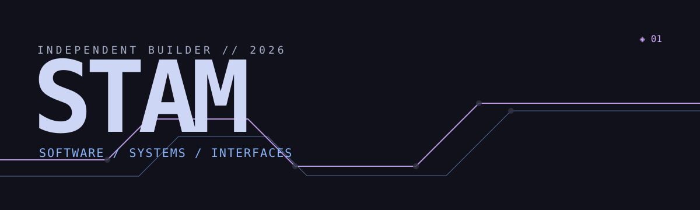
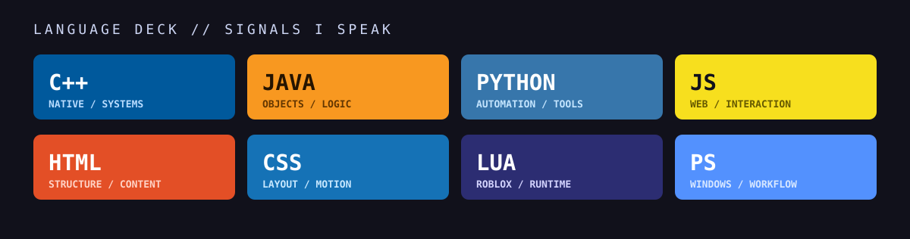

  

  Independent developer making <strong>tools with texture</strong> — Discord systems, web apps, desktop software, and Roblox Studio work that feels considered from the first click.

  <a href="https://stam-console.web.app">Portfolio</a> &nbsp;•&nbsp; <a href="https://github.com/Stamyyyy">GitHub</a>

  

---

## Selected systems

| Build | Signal |
| :-- | :-- |
| [Cartographer](https://github.com/Stamyyyy/cartographer) | Roblox Studio tooling for mission zones, team-safe spawns, objectives, and runtime policies. |
| [Revenant](https://github.com/Stamyyyy/revenant) | A Windows Explorer replacement built around raw NTFS MFT indexing, live browsing, and a recovery-first approach. |
| [Phantom](https://github.com/Stamyyyy/phantom) | Screenshot capture and annotation with a proper post-capture editor, OCR, and useful save rules. |
| [Frontline: Shattered Steel](https://github.com/Stamyyyy/frontline-shattered-steel) | Discord infrastructure and a companion site for a Roblox WWII tactical-warfare community. |
| [stam-console](https://github.com/Stamyyyy/stam-console) | The portfolio itself — an archive of projects, experiments, and the way I approach interface work. |

## What I’m here for

I build the whole thing when it needs building: the workflow, UI, backend, edge cases, and the bit that makes somebody want to keep using it. I’m especially drawn to software that is practical, personal, and a little more alive than it has to be.

`Discord infrastructure` &nbsp; `web tools` &nbsp; `desktop utilities` &nbsp; `Roblox Studio` &nbsp; `interface systems`

<strong>Open the language deck</strong> — the things I use to make it real

 

## Now

Working independently, making specific software, and open to the right commission or collaboration. The best place to see the current signal is [stam-console.web.app](https://stam-console.web.app).

© Stam. All rights reserved.
